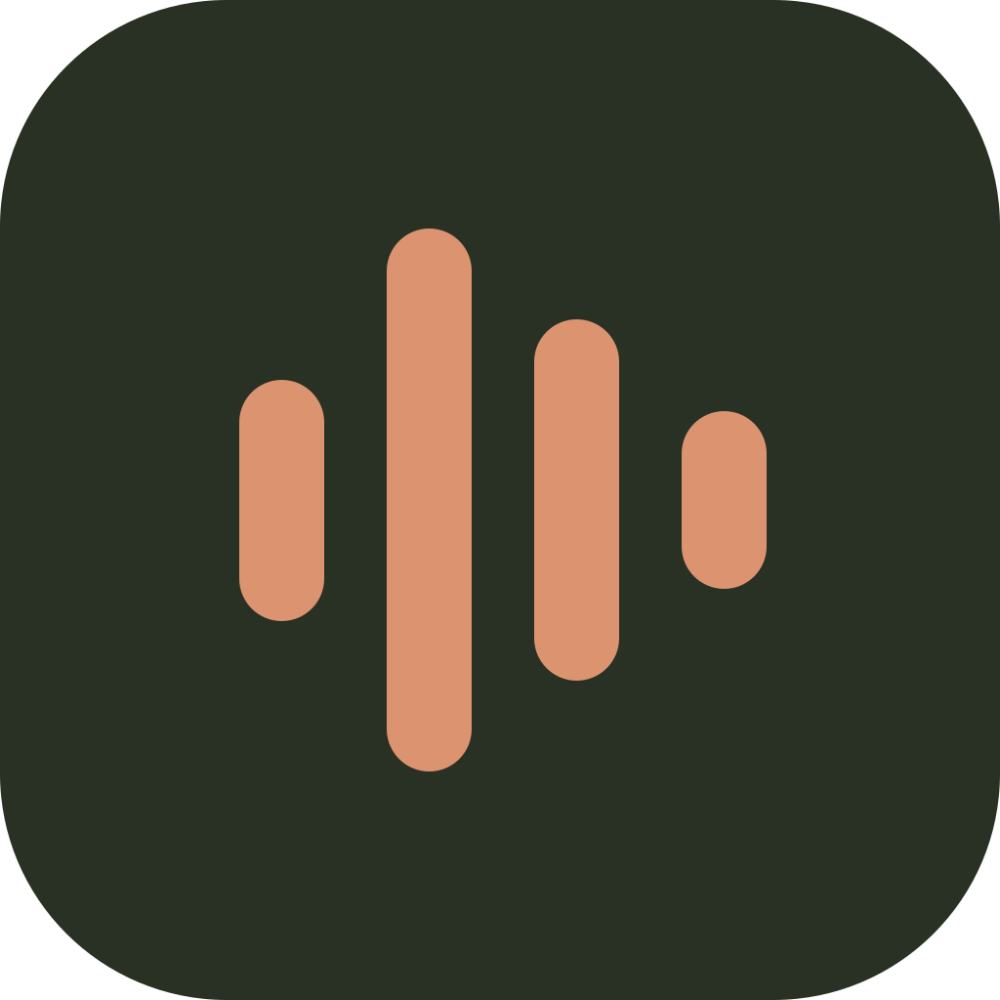

<p align="center">
  
</p>

<h1 align="center">Transcribe</h1>
<p align="center">Sua voz, em palavras. Um pequeno microfone ao lado do que você está fazendo.</p>

<p align="center">
  <a href="https://github.com/listiago/transcrit/releases/latest">Baixar</a> ·
  <a href="#como-usar">Como usar</a> ·
  <a href="https://github.com/listiago/transcrit/issues">Reportar um problema</a> ·
  <a href="LICENSE">Licença MIT</a>
</p>

Transcribe é um aplicativo de ditado para **Windows e macOS**, com interface em português e um minicard flutuante. Clique no microfone, fale e clique novamente: o texto é transcrito e inserido no campo em que você estava escrevendo.

O código é aberto e o aplicativo é gratuito. **Você usa sua própria chave da API OpenAI e paga o consumo diretamente na sua conta.** Uma assinatura do ChatGPT não inclui esse uso. O Transcribe usa o modelo `gpt-transcribe`; não usa Whisper nem uma conexão Realtime.

## Download

**Versão 1.2.5** — instaladores e checksums na [página da versão](https://github.com/listiago/transcrit/releases/tag/v1.2.5).

| Computador | Download | Requisito |
| --- | --- | --- |
| Windows | [Instalador .exe](https://github.com/listiago/transcrit/releases/download/v1.2.5/Transcribe-Setup-1.2.5-x64.exe) | Windows 10 ou superior, x64 |
| Mac com Apple Silicon | [Instalador .dmg](https://github.com/listiago/transcrit/releases/download/v1.2.5/Transcribe-1.2.5-macOS-arm64.dmg) | macOS 13 ou superior, chips da família M |
| Mac com Intel | [Instalador .dmg](https://github.com/listiago/transcrit/releases/download/v1.2.5/Transcribe-1.2.5-macOS-x64.dmg) | macOS 13 ou superior, Intel |

No Mac, confira o chip em **menu Apple → Sobre Este Mac**. Os arquivos ZIP para as duas arquiteturas também estão na página da versão.

**Sobre os avisos de instalação:** esta distribuição ainda não tem certificado comercial no Windows nem assinatura Developer ID/notarização da Apple. O sistema pode exibir um aviso ou bloquear a primeira abertura. Baixe somente deste repositório; não é necessário desativar as proteções do sistema. No macOS, quando disponível, a autorização individual fica em **Ajustes do Sistema → Privacidade e Segurança → Abrir Mesmo Assim**. Consulte a [orientação da Apple](https://support.apple.com/pt-br/102445).

O Windows foi testado com gravação, cliques, atalhos e inserção em outro aplicativo. Os pacotes macOS são compilados no GitHub Actions; **a experiência de ditado em um Mac físico ainda precisa de validação**. Considere o suporte ao Mac experimental nesta versão.

## Como usar

**Abrir pelo ícone ou pela lista de aplicativos mostra a janela completa**, com Configurações sempre acessíveis para trocar sua chave. O atalho global abre o minicard e inicia o ditado. Abrir ao ligar o computador, quando ativado nas preferências, mantém o aplicativo na bandeja.

1. Instale e abra o Transcribe. No Mac, arraste o aplicativo do DMG para **Aplicativos**.
2. Em **Configurações**, salve sua chave OpenAI e permita o acesso ao microfone. O botão **Testar conexão** verifica o acesso ao modelo; transcrever também exige saldo e permissões na conta.
3. Posicione o cursor no campo de texto de outro aplicativo.
4. Clique no **microfone** do card ou use o atalho abaixo. Fale normalmente.
5. Clique no mesmo botão para parar, ou pressione **Enter**. Aguarde a transcrição: o texto será inserido e o card ficará pronto para o próximo ditado.

| Ação | Windows | macOS |
| --- | --- | --- |
| Abrir o card / iniciar ou terminar o ditado | `Ctrl + Shift + Espaço` | `⌘ + Shift + Espaço` |
| Terminar a gravação | `Enter` | `Enter` |
| Cancelar o ditado | `Esc` | `Esc` |

Arraste pela alça para mover o card. **×** cancela e oculta o card; o atalho pode reabri-lo. Configurações, histórico e importação de áudio ficam no ícone da bandeja do Windows ou da barra de menus do Mac. Para encerrar o aplicativo, escolha **Sair do Transcribe** nesse menu.

No Mac, use **Configurações → Permitir inserção** e conceda **Acessibilidade** ao Transcribe. O sistema também pode solicitar permissão de **Automação** para System Events. Sem essas permissões, copie e cole o texto manualmente.

### O que esperar

- Falhas temporárias de conexão recebem até duas novas tentativas automáticas. Erros de chave, permissão ou saldo oferecem acesso às configurações.
- O card permanece pequeno e acima das janelas. O texto completo é inserido ao terminar, sem prévia ao vivo.
- O Transcribe **não envia mensagens nem pressiona Enter no aplicativo de destino**. Enter e Esc são capturados temporariamente durante o ditado.
- Se você mudar de janela durante o processamento, o texto será copiado para colar manualmente. Campos protegidos, aplicativos como administrador e alguns programas podem impedir a inserção automática.
- A inserção usa a área de transferência e substitui seu conteúdo pelo texto transcrito.
- Também é possível importar áudio de até **25 MB**, editar a transcrição e exportar `.txt`. Cada gravação pode durar até **10 minutos**. É necessária internet.
- Não há atualização automática: novas versões ficam em [Releases](https://github.com/listiago/transcrit/releases).

## Seus dados

- **Sem chave compartilhada:** cada pessoa configura sua própria credencial. Ela não fica no código nem nos instaladores.
- **Armazenamento local:** chave e histórico são criptografados com o cofre do sistema, via `safeStorage` do Electron. A chave não é devolvida à interface.
- **Áudio:** fica em memória e é enviado diretamente à API OpenAI, em trechos durante o ditado. Não passa por um servidor do Transcribe e não é salvo em disco pelo aplicativo. Cancelar impede a inserção e o histórico, mas não desfaz os trechos já enviados à API.
- **Histórico:** até 100 transcrições no computador. Pode ser desativado ou apagado; desativar não apaga entradas anteriores. Exportações `.txt` são arquivos comuns, sem criptografia.
- **Sem telemetria:** diagnósticos locais registram estados e códigos de erro, sem áudio, transcrições ou credenciais. Não são enviados automaticamente.

O tratamento dos dados enviados à API segue as [políticas da OpenAI](https://developers.openai.com/api/docs/guides/your-data). O Transcribe é um projeto independente, sem afiliação com a OpenAI.

## Desenvolver e contribuir

Construído com **Electron, React, TypeScript e Vite**. Requer Node.js 24 e npm.

```sh
git clone https://github.com/listiago/transcrit.git
cd transcrit
npm ci
npm run dev
```

Veja [desenvolvimento e testes](docs/DEVELOPMENT.md), [como contribuir](CONTRIBUTING.md) e [segurança](SECURITY.md). Sugestões e relatos de problemas são bem-vindos nas [Issues](https://github.com/listiago/transcrit/issues). Se o aplicativo for útil, deixe uma estrela no repositório. ⭐

## Licença

Copyright © 2026 Tiago Lins. Disponível sob a [licença MIT](LICENSE): você pode usar, modificar e distribuir o código, inclusive comercialmente, respeitando os termos da licença. As bibliotecas mantêm suas [licenças próprias](THIRD_PARTY_NOTICES.md).
